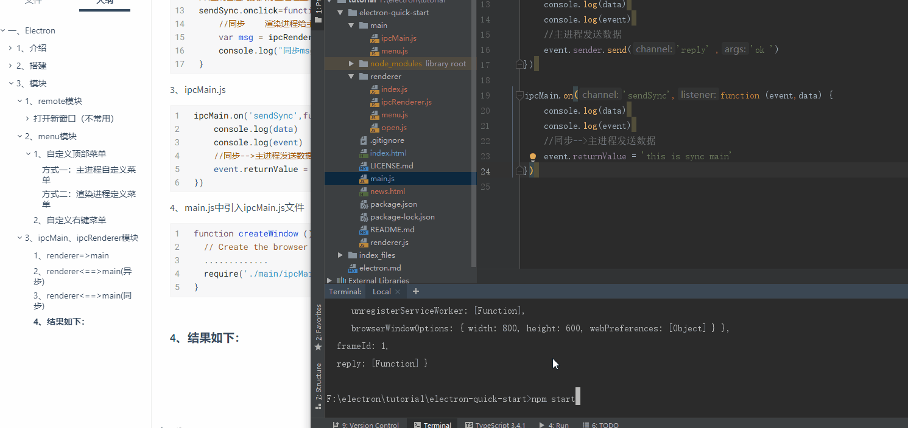

# 一、Electron

## 1、介绍

github地址：https://github.com/electron/electron 

Electron是一个跨平台的桌面应用开发框架，用html css js的技术开发桌面上面可以安装的软件，可以让我们前端人员用html css js的技术开发跨平台可以安装的桌面软件。

1、有开发桌面应用的需求。 （Electron 开发速度快、开发周期短、跨平台 、维护成本低）
2、提升自己的技能。
3、大家都在学，所以我们也得学。 （你不知道 不代表别人不知道）
4、开发开源软件 推广自己的产品 （如：atom   如 vscode    阿里内部的一个软件也是用electron   分发成本低）。
5、同样的功能 开发软件比开发网站更赚钱。  （网站   4k- 1万      app  5-10万        网站   4k- 1万       软件  几万   ）
6、学习 C++  Java成本高，用electron开发、学习成本低。	
7、electron可以和Vue 或者Angular 或者React结合开发。
......

1、NW.js 和Electron介绍
NW.js（英特尔公司提供技术支持）、另一命名为Electron（Github公司提供技术支持）。

2、官网：
https://electronjs.org

四、学习Electron前的准备工作
1.电脑需要安装nodejs
2.电脑上面需要安装git   （提前安装）
3.需要有Html css js 以及nodejs基础     （不具备nodejs也可以学 ，不具备nodejs的话可能不好理解）

Nodejs推荐下载稳定版本：https://nodejs.org/en/
Git下载地址: https://git-scm.com/ 


### 1、运行流程


### 2、主进程和渲染进程
​		Electron 运行 package.json 的 main 脚本的进程被称为主进程。 在主进程中运行的脚本通过创建 web 页面来展示用户界面。 一个 Electron 应用总是有且只有一个主进程。

​		由于 Electron 使用了 Chromium（谷歌浏览器）来展示 web 页面，所以 Chromium 的多进程架构也被使用到。 每个 Electron 中的 web 页面运行在它自己的渲染进程中。

​		主进程使用 BrowserWindow 实例创建页面。每个 BrowserWindow 实例都在自己的渲染进程里运行页面。 当一个 BrowserWindow 实例被销毁后，相应的渲染进程也会被终止。


进程（了解）：进程（Process）是计算机中的程序关于某数据集合上的一次运行活动，是系统进行资源分配和调度的基本单位，是操作系统结构的基础。

线程（了解）：在⼀一个程序里的一个执行路线就叫做线程（thread）。更准确的定义是：线程是“一个进程内部的控制序列”。

线程和进程（了解）：一个程序至少有一个进程,一个进程至少有一个线程


## 2、搭建

```
创建项目 通过git 克隆项目
1.cd到对应的项目里面
2、执行下面命令

# 克隆示例项目的仓库
git clone https://github.com/electron/electron-quick-start
# 进入这个仓库
cd electron-quick-start
		
# 安装依赖并运行
1、cnpm install (npm install) 安装依赖
2、运行 npm start
```


### 1、利用nodejs读取本地文件

​		在普通的浏览器中，web 页面通常在一个沙盒环境中运行，不被允许去接触原生的资源。然而 Electron 的用户在 Node.js 的 API 支持下可以在页面中和操作系统进行一些底层交互。

​		**Nodejs 在主进程和渲染进程中都可以使用**。渲染进程因为安全限制，不能直接操作原生 GUI。虽然如此，因为集成了 Nodejs，渲染进程也有了操作系统底层 API 的能力，Nodejs中常用的 Path、fs、Crypto 等模块在 Electron 可以直接使用，方便我们处理链接、路径、文件 MD5 等，同时 npm 还有成千上万的模块供我们选择。

**不建议在渲染进程中去操作原生的资源**


### 2、小案例：H5拖放显示文件内容

渲染进程：

index.html

```html
<!DOCTYPE html>
<html>
  <head>
    <meta charset="UTF-8">
    <title>Hello World!</title>
    <style>
      .content{
        width: 100%;
        height: 400px;
        background-color: darkorange;
        overflow-y: auto;
      }
    </style>
  </head>
  <body>
    <h1>Hello World!</h1>

    <button id="btn">获取pacage.json</button>

    <textarea id="textarea" cols="40" rows="20"></textarea>
    <br>

    <br>
    <div class="content" id="content"></div>

    <script>
      // You can also require other files to run in this process
      require('./renderer/index')

    </script>
  </body>
</html>
```

index.js

```javascript
/**
 * 渲染进程index.html的index.js
 * */
var fs = require('fs')

window.onload = function () {
    var btn = this.document.querySelector("#btn");
    var textarea = this.document.querySelector("#textarea");
    // alert('1111')
    // 1、获取本地的文件
    fs.readFile('package.json',(err,data)=>{
        // console.log(data)
        //2、赋值给textarea
        textarea.innerHTML = data
    })

    /*
        释放目标时触发的事件:
        ondragenter - 当被鼠标拖动的对象进入其容器范围内时触发此事件
        ondragover - 当某被拖动的对象在另一对象容器范围内拖动时触发此事件
        ondragleave - 当被鼠标拖动的对象离开其容器范围内时触发此事件
        ondrop - 在一个拖动过程中，释放鼠标键时触发此事件
    */
    var content = this.document.querySelector("#content");
    //先将默认的拖放关闭
    content.ondragenter = content.ondragover = content.ondragleave = function () {
        return false;
    }
	//释放鼠标事件，显示文本内容
    content.ondrop = function (e) {
        e.preventDefault();
        console.log(e.dataTransfer.files[0])
        fs.readFile(e.dataTransfer.files[0].path,'utf-8',(err, data) => {
            if (!err){
                content.innerHTML = data;
            } else {
                return false;
            }
        })
    }

}
```


结果如下：


## 3、模块


### 1、remote模块

可以将主进程的模块拉到渲染进程中来用

#### 打开新窗口（不常用）

##### 1、创建一个按钮

```html
<button id="openNewWin">打开新窗口</button>

<script src="renderer/open.js"></script>
```

##### 2、open.js渲染进程

调用主进程的BrowserWindow进行创建

```javascript
var openNewWin = this.document.querySelector("#openNewWin");


//渲染进程没法直接调用主进程中的模块，但是可以通过electron中的remote模块间接调用主进程中的模块

var path = require('path')

var BrowserWindow = require('electron').remote.BrowserWindow;
var win = null;

openNewWin.onclick=function(){
    // alert("click")
    //调用BrowserWindow打开新窗口
    win = new BrowserWindow({
        width: 400,
        height: 300,
        // frame:false //无边框
        fullscreen:true //全屏展示

    })
    //mainWindow.loadFile('index.html')  两种写法
    win.loadURL(path.join('file:',__dirname,'news.html'))

    win.on('close',()=>{
        win = null;
    })
}
```

##### 3、news.html

```html
<!DOCTYPE html>
<html lang="en">
<head>
    <meta charset="UTF-8">
    <meta name="viewport" content="width=device-width, initial-scale=1.0">
    <meta http-equiv="X-UA-Compatible" content="ie=edge">
    <title>Document</title>
    <style>
        body{
            background: orange;
        }
    </style>
</head>
<body>
   news页面
    <br>
    哈哈哈
</body>
</html>
```

##### 4、结果如下


### 2、menu模块

#### 1、自定义顶部菜单

##### 方式一：主进程自定义菜单

1、创建main文件夹，创建menu.js文件

```javascript
/**
 * 创建菜单
 * */

/* 方法一
var electron = require('electron')
var Menu = electron.Menu
*/
//方法二 es6
const { Menu } = require('electron')
//[1]定义菜单
var template = [
    {
        label:'文件',
        submenu:[
            {
                label:'新建文件',
                accelerator:'ctrl+n',//绑定快捷键
                click:function () {//监听点击事件
                    console.log('ctrl+n')
                }
            },
            {
                label:'新建窗口',
                click:function () {
                    console.log('new window')
                }
            }
        ]
    },
    {
        label:'编辑',
        submenu:[
            {
                label:'复制',
                role:`copy`
            },
            {
                label:'剪贴',
                role: `cut`
            },
            {
                label:'粘贴',
                role: `paste`
            }
        ]
    }
]

//[2]配置
var m = Menu.buildFromTemplate(template)
Menu.setApplicationMenu(m)
```

2、主进程main.js中引入

在主进程创建窗口的最后引入menu.js

```javascript
  // Create the browser window.
  mainWindow = new BrowserWindow({
    width: 800,
    height: 600,
    webPreferences: {
      nodeIntegration: true
    }
  })
  // and load the index.html of the app.
  mainWindow.loadFile('index.html')

  // Open the DevTools.开启渲染进程的调试模式
  mainWindow.webContents.openDevTools()

  // Emitted when the window is closed.
  mainWindow.on('closed', function () {
    // Dereference the window object, usually you would store windows
    // in an array if your app supports multi windows, this is the time
    // when you should delete the corresponding element.
    mainWindow = null
  })

  //[3]引入配置菜单
  require('./main/menu')
}
```

3、效果


##### 方式二：渲染进程定义菜单

1、index.html引入menu.js

```html
<script src="renderer/menu.js"></script>
```

2、menu.js

使用remote模块获取到Menu对象

```javascript
/**
 * 创建菜单
 * */

// 方法一
var remote = require('electron').remote
var Menu = remote.Menu
//方法二 es6
//const { Menu } = require('electron').remote


//[1]定义菜单
var template = [
    {
        label:'文件',
        submenu:[
            {
                label:'新建文件',
                accelerator:'ctrl+n',//绑定快捷键
                click:function () {//监听点击事件
                    console.log('ctrl+n')
                }
            },
            {
                label:'新建窗口',
                click:function () {
                    console.log('new window')
                }
            }
        ]
    },
    {
        label:'编辑',
        submenu:[
            {
                label:'复制',
                role:`copy`
            },
            {
                label:'剪贴',
                role: `cut`
            },
            {
                label:'粘贴',
                role: `paste`
            }
        ]
    }
]

//[2]配置
var m = Menu.buildFromTemplate(template)
Menu.setApplicationMenu(m)
```


#### 2、自定义右键菜单

在渲染进程中，沿用方式二的菜单

1、index.html引入menu.js

```html
<script src="renderer/menu.js"></script>
```

2、menu.js

menu.js中最后加入右键的监听

```javascript
/**
 * 创建菜单
 * */

// 方法一
var remote = require('electron').remote
var Menu = remote.Menu
//方法二 es6
//const { Menu } = require('electron').remote


//[1]定义菜单
var template = [
    {
        label:'文件',
        submenu:[
            {
                label:'新建文件',
                accelerator:'ctrl+n',//绑定快捷键
                click:function () {//监听点击事件
                    console.log('ctrl+n')
                }
            },
            {
                label:'新建窗口',
                click:function () {
                    console.log('new window')
                }
            }
        ]
    },
    {
        label:'编辑',
        submenu:[
            {
                label:'复制',
                role:`copy`
            },
            {
                label:'剪贴',
                role: `cut`
            },
            {
                label:'粘贴',
                role: `paste`
            }
        ]
    }
]

//[2]配置
var m = Menu.buildFromTemplate(template)
Menu.setApplicationMenu(m)

//右键菜单
window.addEventListener('contextmenu',function (e) {
    // this.alert('111122222')
    //组织当前窗口默认事件
    e.preventDefault()
    //在当前窗口点击右键的时候弹出  定义的菜单模板
    m.popup({window:remote.getCurrentWindow()})

},false)

```

效果如下：


### 3、ipcMain、ipcRenderer模块

​		Electron 主进程，和渲染进程的通信主要用到两个模块：ipcMain 和ipcRenderer

​		ipcMain：当在主进程中使用时，它处理从渲染器进程（网页）发送出来的异步和同步信息,当然也有可能从主进程向渲染进程发送消息。

​		ipcRenderer： 使用它提供的一些方法从渲染进程 (web 页面) 发送同步或异步的消息到主进程。 也可以接收主进程回复的消息。


#### 1、渲染进程与主进程通信

##### 1、renderer=>main

1、index.html创建测试按钮

```html
    <button id="send">
      渲染进程发送数据给主进程
    </button>

    <script src="renderer/ipcRenderer.js"></script>
```

2、ipcRenderer.js

```javascript
/**
 * 进程之间通信
 * */
var ipcRenderer = require('electron').ipcRenderer

/*
 * 渲染进程给主进程发送消息
 * */
var send = this.document.querySelector("#send");
//渲染进程间接执行主进程里面的方法
send.onclick=function(){
    //渲染进程给主进程广播数据
    ipcRenderer.send('sendM','this is renderer...')

}
```

3、main文件夹中创建ipcMain.js文件

```javascript
/**
 * 主进程处理渲染进程广播的数据
 * */

var ipcMain = require('electron').ipcMain

ipcMain.on('sendM',function (event,data) {
    console.log(data)
    console.log(event)
})
```

4、main.js中引入ipcMain.js文件

```javascript
function createWindow () {
  // Create the browser window.
  .............
  require('./main/ipcMain')
}
```


##### 2、renderer<==>main(异步)

1、index.html

```html
    <button id="sendreply">
      渲染进程发送信息并获得反馈(异步)
    </button>

    <script src="renderer/ipcRenderer.js"></script>

```

2、ipcRenderer.js

```javascript
/**
 * 进程之间通信
 * */
var ipcRenderer = require('electron').ipcRenderer

/*
* 渲染进程发送数据并获得反馈（异步）
* */
var sendreply = this.document.querySelector("#sendreply");

//渲染进程间接执行主进程里面的方法
sendreply.onclick=function(){
    //渲染进程给主进程广播数据
    ipcRenderer.send('sendReply','this is renderer...reply')
}

ipcRenderer.on('reply',function (event,data) {
    console.log('feedback ' + data)
})
```


3、ipcMain.js

```javascript
var ipcMain = require('electron').ipcMain
ipcMain.on('sendReply',function (event,data) {
    console.log(data)
    console.log(event)
    //主进程发送数据
    event.sender.send('reply' ,'ok ')
})
```

4、main.js中引入ipcMain.js文件

```javascript
function createWindow () {
  // Create the browser window.
  .............
  require('./main/ipcMain')
}
```


##### 3、renderer<==>main(同步)

同步通信会直接返回数据

1、index.html

```html
    <button id="sendSync">
      渲染进程发送信息并获得反馈(同步)
    </button>

    <script src="renderer/ipcRenderer.js"></script>

```

2、ipcRenderer.js

```javascript
/**
 * 进程之间通信
 * */
var ipcRenderer = require('electron').ipcRenderer

/*
* 渲染进程发送数据并获得反馈（同步）
* */

var sendSync = this.document.querySelector("#sendSync");

//渲染进程间接执行主进程里面的方法
sendSync.onclick=function(){
    //同步    渲染进程给主进程广播数据
    var msg = ipcRenderer.sendSync('sendSync','this is renderer...sendSync')
    console.log("同步msg::"+msg)
}
```

3、ipcMain.js

```javascript
ipcMain.on('sendSync',function (event,data) {
    console.log(data)
    console.log(event)
    //同步-->主进程发送数据
    event.returnValue = 'this is sync main'
})
```

4、main.js中引入ipcMain.js文件

```javascript
function createWindow () {
  // Create the browser window.
  .............
  require('./main/ipcMain')
}
```


##### 4、结果如下：




#### 2、渲染进程之间相互通信

> 以下是主进程的方式创建新窗口，[渲染进程方式在这](# 打开新窗口（不常用）)

##### 1、localStorage方式

1、创建按钮

```html
<button id="openNewMainWin">打开新窗口(主进程)</button>
```

2、open.js

```javascript

/** ====================主进程方式======================================
* 主进程打开新窗口
 * 渲染进程=》渲染进程传值
* */
var {ipcRenderer} = require('electron')
openNewMainWin.onclick = function () {
    ipcRenderer.send('openWindow','open main windows')
    /*
    * 方法一：通过localStorage实现页面传值
    * */
    var aid = 123;
    localStorage.setItem('aid',aid)
}
```

3、ipcMain.js

```javascript

//========================================================
/*
* 主进程打开新窗口
* */
// var {BrowserWindow} = require('electron')
var path = require('path')
var BrowserWindow = require('electron').BrowserWindow;
var win = null;
ipcMain.on('openWindow',function (event,aid) {
    //alert('hello')
    //调用BrowserWindow打开新窗口
    win = new BrowserWindow({
        width: 400,
        height: 300,
        // frame:false //无边框
        //fullscreen:true //全屏展示
        webPreferences: {
            //开新窗口必须加，否则新窗口使用require会报错ReferenceError: require is not define
            nodeIntegration: true
        }
    })
    //mainWindow.loadFile('index.html')  两种写法
    win.loadURL(path.join('file:',__dirname,'../news.html'))
    //开启新窗口的调试模式
    win.webContents.openDevTools()

    win.on('close',()=>{
        win = null;
    })
})
```

4、news.js

```javascript
//获取localStorage的数据
var aid = localStorage.getItem('aid')
console.log("news::" + aid)
```

5、news.html

引入news.js

```html
<!DOCTYPE html>
<html lang="en">
<head>
    <meta charset="UTF-8">
    <meta name="viewport" content="width=device-width, initial-scale=1.0">
    <meta http-equiv="X-UA-Compatible" content="ie=edge">
    <title>Document</title>
    <style>
        body{
            background: orange;
        }
    </style>
</head>
<body>
   news页面
    <br>
    哈哈哈
   <script src="./renderer/news.js"></script>
</body>
</html>

```


##### 2、win.webContents.send方式


1、open.js

```javascript

/** ====================主进程方式======================================
* 主进程打开新窗口
 * 渲染进程=》渲染进程传值
* */
var {ipcRenderer} = require('electron')
openNewMainWin.onclick = function () {
    var aid1 = 123456;
    ipcRenderer.send('openWindow',aid1)
}
```

3、ipcMain.js

```javascript

//========================================================
/*
* 主进程打开新窗口
* */
// var {BrowserWindow} = require('electron')
var path = require('path')
var BrowserWindow = require('electron').BrowserWindow;
var win = null;
ipcMain.on('openWindow',function (event,aid) {
    //alert('hello')
    //调用BrowserWindow打开新窗口
    win = new BrowserWindow({
        width: 400,
        height: 300,
        // frame:false //无边框
        //fullscreen:true //全屏展示
        webPreferences: {
            //开新窗口必须加，否则新窗口使用require会报错ReferenceError: require is not define
            nodeIntegration: true
        }
    })
    //mainWindow.loadFile('index.html')  两种写法
    win.loadURL(path.join('file:',__dirname,'../news.html'))
    //开启新窗口的调试模式
    win.webContents.openDevTools()

    //通过win.webContents.send()吧当前数据广播给news.html渲染进程
    win.webContents.on('did-finish-load',function () {
        console.log('did-finish-load::'+aid)
        //****************************
        win.webContents.send('tonews',aid)
    })

    win.on('close',()=>{
        win = null;
    })
})
```

3、news.js

```javascript
var {ipcRenderer} = require('electron')

ipcRenderer.on('tonews',function (event, aid) {
    console.log(aid)
})
```

4、结果如下：


### 3、shell模块

使用a标签跳转页面时会直接将内容替换成跳转后网页的内容


若要使用系统自带的浏览器打开页面则需要shell模块

#### 调用默认浏览器

1、创建a标签

```html
<a id="adom" href="https://www.baidu.com">itying.com</a>

<script src="renderer/link.js"></script>
```

2、创建link.js文件

```javascript

var {shell}=require('electron')

var aDom=document.querySelector('#adom');


aDom.onclick=function(e){
    // 阻止a标签的默认行为
    e.preventDefault();
    var href=this.getAttribute('href');
    //sheel模块打开外部浏览器
    shell.openExternal(href)
}
```

3、效果如下：


### 4、dom标签

#### 1、iframe标签


> 说明：
> 1、electron5.x中建议使用iframe替代webview
> 2、electronic的webview标签基于Chromium的webview，后者正在经历巨大的架构变化。
> 这将影响webview的稳定性，包括呈现、导航和事件路由。我们目前建议不使用webview标签，
> 并考虑其他替代方案，如iframe、electronic的BrowserView或完全避免嵌入内容的体系结构。
> 来源：https://electronjs.org/docs/api/webview-tag

##### 通过菜单进行页面跳转

1、顶部菜单制作

```javascript
var {Menu,shell,BrowserWindow}=require('electron');
//浏览器跳转
function openWeb(url){
    shell.openExternal(url);
}
//iframe页面跳转
function openWebview(url){
    var win=BrowserWindow.getFocusedWindow();
    win.webContents.send('openWebview',url);
}

var template=[

    {
        label: '加载网页',
        submenu: [
            {
                label: '腾讯',
                click:function(){
                    console.log(BrowserWindow.getFocusedWindow());
                    var winId=BrowserWindow.getFocusedWindow().id;
                    console.log(winId);
                    console.log(BrowserWindow.fromId(winId))

                  openWebview('http://www.qq.com')
                }
            },
            {
                type: 'separator'
            },
            {
                label: '百度',
                click:function(){
                    openWebview('http://www.baidu.com')
                }
            }

        ]
    },
    {
        label: '帮助',
        submenu:[
            {
                label: '百度',
                click:function(){
                    openWeb('https://www.baidu.com');
                }
            },
            {
                type: 'separator'  /*分隔符*/
            },
            {
                label: '联系我们',
                click:function(){
                    openWeb('https://www.itying.com');
                }
            }
        ]
    }

]
var m=Menu.buildFromTemplate(template);
Menu.setApplicationMenu(m);
```

2、主进程引入js文件

```javascript
function createWindow () {
  // Create the browser window.
  ............
  require('./main/Menu.js');
}
```

3、渲染进程index.html

```html
    <iframe id="myWebview" src="https://www.baidu.com" style="position: fixed;width: 100%;height: 100%"></iframe>

    <script src="renderer/webview.js"></script>
```

4、修改URL

```javascript
var {ipcRenderer}=require('electron');


var myWebviewDom=document.querySelector('#myWebview');

ipcRenderer.on('openWebview',function(event,data){
    console.log('loading...'+data)
    // data就是链接地址
    myWebviewDom.src=data;
})
```

5、效果如下


### 5、dialog模块

dialog模块属于主进程，但是为了方便在渲染进程执行，也符合常理

1、dialog.html

```html
<button id="error">失败提示框</button>

<button id="mesageBox">showMessageBox</button>

<button id="openDialog">showOpenDialog</button>

<button id="saveDialog">showSaveDialog</button>

<script src="renderer/dialog.js"></script>
```

2、dialog.js文件


```javascript
/**
* 弹出框
* */
var {remote}=require('electron');


//https://electronjs.org/docs/api/dialog
var errorDom=document.querySelector('#error');

var mesageBoxDom=document.querySelector('#mesageBox');

var openDialogDom=document.querySelector('#openDialog');

var saveDialogDom=document.querySelector('#saveDialog');

/*
* 错误框
* */
errorDom.onclick=function(){
    remote.dialog.showErrorBox('警告','操作有误');
}

/*
* 提示框
* */
mesageBoxDom.onclick=function(){
    remote.dialog.showMessageBox({
        type:'info',
        title:'提示信息',
        message:'内容',
        buttons:['ok','no']

    },function(index){

        console.log(index)
    })


}

/*
* 选择文件
* */
openDialogDom.onclick=function(){


    remote.dialog.showOpenDialog({

        // properties:['openDirectory','openFile']
        //[允许选择文件 , 允许选择文件夹]

        properties:['openFile']

    },function(data){//返回文件路径
        console.log(data);
        //["C:\Users\Administrator\Desktop\新建文件夹\js\index.js"]
    })

}

/*
* 保存文件
* */
saveDialogDom.onclick=function(){
    remote.dialog.showSaveDialog({

        title:'save file',
        defaultPath:"aaa.jpg",
        filters: [
            {name: 'Images', extensions: ['jpg', 'png', 'gif']},
            {name: 'Movies', extensions: ['mkv', 'avi', 'mp4']},
            {name: 'Custom File Type', extensions: ['as']},
            {name: 'All Files', extensions: ['*']}
        ]

    },function(path){ //返回保存路径
        console.log(path);
        // C:\Users\Administrator\Desktop\新建文件夹\js\aaa.jpg
        //保存以后会打印保存的路径  , 但是不会实现真的保存功能  （具体保存什么数据可以写在nodejs里面）
    })
}
```

3、效果展示


### 6、tray模块

> 系统托盘、托盘右键菜单

#### 1、关闭隐藏托盘/托盘菜单、托盘鼠标闪烁

1、添加静态图片

创建static文件夹，将图片放入

2、编写tray.js文件

```javascript
var {Menu, Tray, BrowserWindow, app} = require('electron');

var path = require('path');


var iconTray = new Tray(path.join(__dirname, '../static/favicon2.ico'));

//绑定右键菜单
var trayMenu = Menu.buildFromTemplate([

    {

        label: '设置',
        click: function () {

            console.log('setting')
        }
    },
    {

        label: '升级',
        click: function () {

            console.log('update')
        }
    },
    {

        label: '退出',
        click: function () {
            if (process.platform !== 'darwin') {
                app.quit();
            }
        }
    }
]);
iconTray.setContextMenu(trayMenu);
//鼠标悬停提示文字
iconTray.setToolTip('electron应用');


//实现点击关闭按钮让应用保存在托盘里面 ，双击托盘打开应用
var win = BrowserWindow.getFocusedWindow();
win.on('close', (e) => {
    console.log(win.isFocused());
    if (!win.isFocused()) { //创建是否在显示   true:显示 false:隐藏
        win = null;
    } else {
        e.preventDefault();  //阻止窗口的关闭事件
        win.hide();
    }

})


//监听任务栏图标的点击事件
iconTray.on('double-click', function () {
    win.show();
})


//闪烁图标
var count = 0;
var timer = setInterval(function () {
    count++;

    if (count % 2 == 0) {

        iconTray.setImage(path.join(__dirname, '../static/favicon2.ico'))

    } else {

        iconTray.setImage(path.join(__dirname, '../static/empty.ico'))
    }

}, 500)


```

3、引入tray.js文件

```javascript
mainWindow.loadFile('tray.html')
```

4、效果展示


### 7、消息通知模块

> 由于win使用new Notification()方式弹不出来，所以使用第三方的node-notifier，跨平台通知
>
> 详见https://github.com/mikaelbr/node-notifier

#### 网络监听消息通知

> 是否断网发出通知

1、安装node-notifier库

```cmd
npm install --save node-notifier
```

2、创建notify.html

```html
<!DOCTYPE html>
<html lang="en">
<head>
    <meta charset="UTF-8">
    <title>Title</title>
</head>
<body>
<button id="btn">通知</button>


<script src="renderer/notify1.js"></script>

</body>
</html>

```

3、编写notify1.js文件

```javascript
/**
* 消息通知   node-notifier
* */
const notifier = require('node-notifier')
const path = require('path')

const msg = "系统通知测试!"
//notice(msg)
// String
//notifier.notify('Message').body('hello').icon(path.join(__dirname, 'static/favicon2.ico'));

// Object
/*notifier.notify({
    title: 'My notification',
    message: 'Hello, there!',
    icon: path.join(__dirname, 'static/favicon2.ico'),
});*/

/**
 * System Notification
 * @param {string} msg
 */
function notice(msg) {
    console.log('111111'+__dirname)
    /** https://github.com/mikaelbr/node-notifier */
    notifier.notify({
        title: '消息通知',
        message: msg,
        icon: path.join(__dirname, 'static/favicon2.ico'),
        sound: true,
        wait:true,
        body:msg
    }, function (err, response) {
        // Response is response from notification
    }).on('click', function (notifierObject, options) {
        // Triggers if `wait: true` and user clicks notification
        console.log("点击通知")
    }).on('timeout', function (notifierObject, options) {
        // Triggers if `wait: true` and notification closes
        console.log("忽视超时")
    });
}

//点击按钮实现通知
var btn=document.querySelector('#btn');

btn.onclick=function(){
    notice("点击按钮通知")
}


/**====================================================================
* 网络监控
* */
window.addEventListener('online',function () {
    notice('有网络')
})

window.addEventListener('offline',function () {
    notice("网络已断开")
})

```

4、效果


### 8、剪切板模块

> globalShortcut模块和naiveImage模块

#### 1、剪切文字

1、创建一个span

```html
机器码：<span class="red" id="code">fhdsof3820r482fhneeu9032u4802chuofj082488502j</span>

<script src="renderer/clipboard.js"></script>
```

2、编写clipboard.js文件

```javascript
/**
*   clipboard模块  主进程和渲染进程都可以使用
* */

var {clipboard } = require('electron')

/*
* 双击复制机器码   剪切文字
* */
var code = document.querySelector('#code')
var input = document.querySelector('#input')
console.log(code)
code.onclick = function () { //单击
    clipboard.writeText(code.innerHTML)
    console.log('success')
}
code.ondblclick = function () { //双击
    clipboard.writeText(code.innerHTML)
    input.value = code.innerHTML
    console.log('双击success')
}

```

3、效果


#### 2、剪切图片

1、button按钮

```html
<button id="btncopyimg">剪切板图片</button>

<script src="renderer/clipboard.js"></script>
```

2、编写剪切图片模块

`clipboard.writeImage`需要用到nativeImage模块对象

```javascript
/**
*   clipboard模块  主进程和渲染进程都可以使用
* */

var {clipboard , nativeImage} = require('electron')

/*
* 赋值图片  剪切板——图片
* */
var  btncopyimg=document.querySelector('#btncopyimg');

btncopyimg.onclick=function(){
    //复制图片黏贴到我们页面上
    /*
    1.引入nativeImage
    2、创建一个nativeImage的对象
    */
    var image=nativeImage.createFromPath('static/favicon2.ico');
    //复制图片
    clipboard.writeImage(image);
    //粘贴图片
    var imgsrc=clipboard.readImage().toDataURL();
    console.log(imgsrc);   //base64的地址
    //创建一个img标签 指定他的src
    var imgDom=new Image();
    imgDom.src=imgsrc;
    document.body.appendChild(imgDom);
}
```

3、效果


# 二、Electron - Vue

> Github 地址：https://github.com/SimulatedGREG/electron-vue
> Electron-vue 文档：https://simulatedgreg.gitbooks.io/electron-vue/content/cn/

## 1、搭建

```cmd
# 安装 vue-cli 和 脚手架样板代码
npm install -g vue-cli
vue init simulatedgreg/electron-vue my-project

# 安装依赖并运行你的程序
cd my-project
yarn # 或者 npm install
yarn run dev # 或者 npm run dev
```

安装的时候ESlint不用装，还有调试工具`Set up unit testing with Karma + Mocha?`和`Set up end-to-end testing with Spectron + Mocha?`也不用装

## 2、简单使用

> 实现功能：
>
> 【1】vue路由切换
>
> 【2】打开外部浏览器浏览网页
>
> 【3】主进程与渲染进程间通信

### 1、修改App.vue

renderer文件夹下的App.vue为主窗口，修改此主窗口，形成单页面应用

利用router-link对router-view的内容进行修改

```html
<!--
  主窗口
-->

<template>
  <div id="app">

    <div class="header">

      <!--根据路由展示不同内容-->
      <router-link to="home">首页</router-link>
      <router-link to="news">新闻</router-link>

    </div>

    <router-view></router-view>
  </div>
</template>

<script>
  export default {
    name: 'electronvuedemo01'
  }
</script>

<style>
  /* CSS */
  .header{
    height: 44px;
    line-height: 44px;
    text-align: center;
    background: red;
  }
</style>
```

### 2、创建Home.vue和News.vue

将compponents里面默认的删除，添加Home.vue和News.vue两个文件

#### Home.vue

> 主要功能：广播数据、默认浏览器打开百度

```html
<template>
    <div id="home">
        {{msg}}
        <br>
        <br>
        <button @click="send()">给主进程广播数据</button>

        <!--click.stop  阻止冒泡
        click.prevent   阻止默认行为
        -->
        <a id="url" @click.prevent="openUrl($event)" href="http://www.baidu.com">打开百度</a>

        <button @click="runNode()">使用nodejs的模块</button>
    </div>
</template>

<script>
    var path = require('path')

    export default {
        name: "Home",
        data(){
            return{
                msg:'首页组件'
            }
        },
        methods:{
            send() {
                alert('执行了')
                //发送数据给主线程
                this.$electron.ipcRenderer.send('toMain',"我是渲染进程数据")
            },
            openUrl(event){
                console.log(event)
                this.$electron.shell.openExternal(event.srcElement.href)
            },
            runNode(){
                var dir = path.join(__filename,'/aaaa')
                console.log("dir::" + dir)
            }
        }
    }
</script>
<style scoped>
</style>
```

#### News.vue

> 使用nodejs的fs模块读取文件

```html
<template>
    <div id="news">
        新闻组件
        <button @click="runNode()">使用nodejs的模块</button>
    </div>
</template>

<script>
    var fs = require('fs')

    export default {
        data(){
            return{
                msg:'我是新闻组件'
            }
        },
        methods:{
            runNode(){
                fs.readFile('package.json',function(err,data){
                    if (err){
                        console.log(err)
                        return false
                    }else {
                        console.log(data.toString())
                        return true
                    }
                })
            }
        }
    }
</script>
```

### 3、配置路由

> renderer/router文件夹下修改index.js文件

```javascript
import Vue from 'vue'
import Router from 'vue-router'

Vue.use(Router)

//引入两个vue
import News from '@/components/News.vue'
import Home from '@/components/Home.vue'

export default new Router({
  routes: [
    {
      path: '/',
      name: 'home',
      component: Home
    },
    {
      path: '/news',
      name: 'news',
      component: News
    },
    {
      path: '*',
      redirect: '/'
    }
  ]
})

```

### 4、主进程ipcMain.js

main文件夹下创建ipcMain.js文件

```javascript
var {ipcMain}= require('electron')

/*
* 接收渲染进程广播数据
* */
ipcMain.on('toMain',function (event, data) {
    console.log('main::data:'+data)
})
```

在index.js文件里引入ipcMain.js模块

```javascript
function createWindow () {
	.............

  //引入ipcMain.js
  require('./ipcMain')

}
```

### 5、效果展示


## 3、Element-UI使用

### 1、安装

1.安装`npm i element-ui -S`


2、引入以及配置element-ui   renderer/main.js
```javascript
import ElementUI from 'element-ui';
import 'element-ui/lib/theme-chalk/index.css';
Vue.use(ElementUI);
```


3、看文档使用 

>https://element.eleme.cn/#/zh-CN  找到组件
```html
<el-button type="primary">主要按钮</el-button>
<el-button type="success">成功按钮</el-button>
<el-button type="info">信息按钮</el-button>
```


### 2、使用scss

> 写css样式时可以进行嵌套写
>
> <https://www.npmjs.com/package/sass-loader/v/7.0.0>

1.安装sass-loader node-sass      

`npm install --save-dev sass-loader node-sass`

2、vue中使用scss

嵌套写法


### 3、页面中通过import引入scss

如：  import '../assets/style.scss'


1、安装npm

`npm install --save-dev sass-loader node-sass`


2、配置webpack.renderer.config.js

```javascript
 {
        test: /\.scss$/,
        use: [
            "style-loader", // creates style nodes from JS strings
            "css-loader", // translates CSS into CommonJS
            "sass-loader" // compiles Sass to CSS, using Node Sass by default
        ]
    }
```

3、import

通过import命令引入scss了      ` import '../assets/style.scss'`


### 4、自定义最大化、最小化、关闭

1、创建BrowserWindow处使用`frame:false`去边框

```javascript
  mainWindow = new BrowserWindow({
    height: 563,
    useContentSize: true,
    width: 1000,
    frame:false //去边框
  })
```

2、自定义MyHeader.vue

图标使用的iconfont，[详见](# 三、vue使用iconfont)

```html
<template>
    <div id="myHeader">
        <div class="titlebtn">
            <div class="min"  @click="min"><i class="iconfont">&#xe623;</i></div>
            <div class="max" @click="max"><i class="iconfont">&#xe665;</i></div>
            <div class="close" @click="close"><i class="iconfont">&#xe6fc;</i></div>
        </div>

    </div>
</template>

<script>
    export default {
        name: "MyHeader",
        data(){
            return{
            }
        },
        methods:{
            min(){
                console.log('min')
                this.$electron.ipcRenderer.send('window-min');
            },
            max(){
                this.$electron.ipcRenderer.send('window-max');
            },
            close(){
                this.$electron.ipcRenderer.send('window-close');
            }

        }
    }
</script>

<style lang="scss">
    #myHeader {
        width: 100%;
        height: 44px;
        line-height: 44px;
        background-color: rgb(198, 47, 47);
        /*使得myHeader可以进行拖拽*/
        -webkit-app-region: drag;
    }

        .titlebtn {
            position: relative;
        width: 200px;
        height: 44px;
        line-height: 44px;
        float: right;
        -webkit-app-region: no-drag;

        .min{
            position: absolute;
            /*background: green;*/
            right: 100px;
            width: 20px;
            /*鼠标悬停变为手型*/
            cursor:pointer;
            img{
                width: 100%;
                margin-top:6px;
            }
        }
        .max{
            position: absolute;
            /*background: yellow;*/
            right: 60px;
            width: 20px;
            cursor:pointer;
        }
        .close{
            position: absolute;
            /*background:black;*/
            right:20px;
            width: 20px;
            cursor:pointer;
        }
    }
</style>
```

3、App.vue主窗口引入调用

引入+注册

```javascript
<script>
  /*将自定义的MyHeader.vue引入*/
  import MyHeader from './components/MyHeader'
  export default {
    name: 'electronvuedemo01',
    /*将自定义的注册进来*/
    components:{
      MyHeader:MyHeader
    }
  }
</script>
```

4、App.vue模板中使用MyHeader标签

```html
<template>
  <div id="app">
    <MyHeader />
	......................
  </div>
</template>
```


5、ipcMain.js

```javascript

/*
* 接收渲染进程广播的数据执行最小化 最大化  关闭的操作
* */

//获取当前的窗口对象   BrowserWindow.getFocusedWindow();
var mainWindow= BrowserWindow.getFocusedWindow();

ipcMain.on('window-min',()=>{

    console.log('window-min')

    mainWindow.minimize()
})

ipcMain.on('window-max',()=>{

    if(mainWindow.isMaximized()){
        mainWindow.restore();//恢复到以前的状态
    }else{
        mainWindow.maximize()
    }
})

ipcMain.on('window-close',()=>{
    mainWindow.close()
})

```

6、index.js引入ipcMain.js

```javascript
function createWindow () {
  /**
   * Initial window options
   */
  mainWindow = new BrowserWindow({
    height: 563,
    useContentSize: true,
    width: 1000,
    frame:false //去边框
  })
  mainWindow.loadURL(winURL)

  mainWindow.on('closed', () => {
    mainWindow = null
  })
  //去掉顶部菜单
  mainWindow.setMenu(null)
  //引入ipcMain.js
  require('./ipcMain')

}
```

7、效果


# 三、vue使用iconfont

1. 百度搜索iconfont，去官网创建项目

2. 在我的项目里面新建项目


3. 项目创建完成后去图标库添加图标至购物车


4. 点击右上角的购物车图标，把购物车内图标添加至项目


5. 在回到我的项目，把图标下载到本地，解压文件


6. 在解压文件夹中把所有的字体文件和iconfont.css拷贝至项目中，此处需要注意字体文件和iconfont.css的位置关系，因为css引用字体文件时是相对路径


7.项目中文件和引用路径要一一对牢


8.项目中使用，首先在main.js中全局引入iconfont.css，再在iconfont网站中我的项目里复制需要的图标代码，然后在你需要的地方使用即可。


# 四、vue使用echarts/highechart

## 1、vue-highechart

> 详见https://github.com/highcharts/highcharts-vue

### 1、安装

```cmd
cnpm i vue-highcharts -S
cnpm i highcharts -S
```

### 2、main.js引入vue-highechart

```javascript
import VueHighcharts from 'vue-highcharts'
Vue.use(VueHighcharts)
```

### 3、使用

在Home.vue中小demo

```html
<template>
    <div id="home" style="width: 100%">
        首页组件
        <highcharts :options="areaOptions"></highcharts>

        <highcharts :options="columnOption"></highcharts>
    </div>
</template>

<script>
    var areaOptions={
        chart: {
            plotBackgroundColor: null,
            plotBorderWidth: null,
            plotShadow: false,
            type: 'pie',
            backgroundColor: '#eeeeee'
        },
        credits:{
            enabled: false // 禁用版权信息
        },
        title: {
            text: '全国人口分布图'
        },
        tooltip: {
            pointFormat: '{series.name}: <b>{point.percentage:.1f}%</b>'
        },
        plotOptions: {
            pie: {
                allowPointSelect: true,
                cursor: 'pointer',
                dataLabels: {
                    enabled: true,
                    format: '<b>{point.name}</b>: {point.percentage:.1f} %',
                    // style: {
                    // 		color: (this.$Highcharts.theme && Highcharts.theme.contrastTextColor) || 'black'
                    // }
                }
            }
        },
        series: [{
            name: '分布比例',
            colorByPoint: true,
            data: [{
                name: '深圳',
                y: 614111,
                sliced: true,
                selected: true
            }, {
                name: '北京',
                y: 213111
            }, {
                name: '上海',
                y: 213111
            }, {
                name: '武汉',
                y: 613111
            }, {
                name: '广州',
                y:813111
            }]
        }]
    };


    //柱状图
    var columnOption={
        chart: {
            type: 'column'
        },
        title: {
            text: '舆情数量统计'
        },
        subtitle: {
            text: '数据来源: itying.com'
        },
        xAxis: {
            categories: [
                '一月','二月','三月','四月','五月','六月','七月','八月','九月','十月','十一月','十二月'
            ],
            crosshair: true
        },
        yAxis: {
            min: 0,
            title: {
                text: '舆情数量'
            }
        },
        tooltip: {
            // head + 每个 point + footer 拼接成完整的 table
            headerFormat: '<span style="font-size:10px">{point.key}</span><table>',
            pointFormat: '<tr><td style="color:{series.color};padding:0">{series.name}: </td>' +
                '<td style="padding:0"><b>{point.y:.1f} mm</b></td></tr>',
            footerFormat: '</table>',
            shared: true,
            useHTML: true
        },
        plotOptions: {
            column: {
                borderWidth: 0
            }
        },
        series: [{
            name: '正面',
            data: [49.9, 71.5, 106.4, 129.2, 144.0, 176.0, 135.6, 148.5, 216.4, 194.1, 95.6, 54.4],

            color: 'blue'
        }, {
            name: '负面',
            data: [83.6, 78.8, 98.5, 93.4, 106.0, 84.5, 105.0, 104.3, 91.2, 83.5, 106.6, 92.3],
            color:'red'
        }]
    }

    export default {
        name: 'home',
        data(){
            return{
                areaOptions:areaOptions,
                columnOption:columnOption
            }
        },

        methods: {
            open (link) {
                // this.$electron.shell.openExternal(link)
            }
        }
    }
</script>

<style lang="scss">

</style>

```

### 4、效果如下


## 2、vue-echarts

> 详见 <https://github.com/ecomfe/vue-echarts/blob/master/README.zh_CN.md>
>
> 我没试成功，换种方式[https://www.echartsjs.com/tutorial.html#%E5%9C%A8%20webpack%20%E4%B8%AD%E4%BD%BF%E7%94%A8%20ECharts](https://www.echartsjs.com/tutorial.html#在 webpack 中使用 ECharts)

### 1、安装

```cmd
cnpm install echarts -S
```

### 2、main.js中引入

```cmd
// 引入echarts
import echarts from 'echarts'
Vue.prototype.$echarts = echarts
```

### 3、使用

在report.vue中写demo

```html
<template>
    <div id="report"  style="width: 100%">
        报表组件{{msg}}
        <!-- 为 ECharts 准备一个具备大小（宽高）的 DOM -->
        <div id="myChart" style="width: 50%;height:400px;"></div>
        <div id="myChart1" style="width: 50%;height:400px;"></div>
    </div>
</template>

<script>
    export default {
        name: 'report',
        data() {
            return {
                msg: 'Welcome to Your Vue.js App'
            }
        },
        mounted() {
            this.drawLine();
        },
        methods: {
            drawLine() {
                // 基于准备好的dom，初始化echarts实例
                let myChart = this.$echarts.init(document.getElementById('myChart'))
                let myChart1 = this.$echarts.init(document.getElementById('myChart1'))
                // 绘制图表
                myChart.setOption({
                    title: {text: '在Vue中使用echarts'},
                    tooltip: {},
                    xAxis: {
                        data: ["衬衫", "羊毛衫", "雪纺衫", "裤子", "高跟鞋", "袜子"]
                    },
                    yAxis: {},
                    series: [{
                        name: '销量',
                        type: 'bar',
                        data: [5, 20, 36, 10, 10, 20]
                    }]
                });
                // 绘制图表
                myChart1.setOption( {
                    title : {
                        text: '某站点用户访问来源',
                        subtext: '纯属虚构',
                        x:'center'
                    },
                    tooltip : {
                        trigger: 'item',
                        formatter: "{a} <br/>{b} : {c} ({d}%)"
                    },
                    legend: {
                        orient: 'vertical',
                        left: 'left',
                        data: ['直接访问','邮件营销','联盟广告','视频广告','搜索引擎']
                    },
                    series : [
                        {
                            name: '访问来源',
                            type: 'pie',
                            radius : '55%',
                            center: ['50%', '60%'],
                            data:[
                                {value:335, name:'直接访问'},
                                {value:310, name:'邮件营销'},
                                {value:234, name:'联盟广告'},
                                {value:135, name:'视频广告'},
                                {value:1548, name:'搜索引擎'}
                            ],
                            itemStyle: {
                                emphasis: {
                                    shadowBlur: 10,
                                    shadowOffsetX: 0,
                                    shadowColor: 'rgba(0, 0, 0, 0.5)'
                                }
                            }
                        }
                    ]
                });
            }
        }
    }
</script>

<style lang="scss">
    /**
     * 默认尺寸为 600px×400px，如果想让图表响应尺寸变化，可以像下面这样
     * 把尺寸设为百分比值（同时请记得为容器设置尺寸）。
     */

</style>

```

### 4、效果展示


30——23


# 五、登录模块

## 1、新建弹窗

弹窗效果相比新页面而言比较好，所以推荐使用弹窗效果

### 1、添加代码

在Home.vue中添加

弹出登录框时需要防止添加其他地方或者按esc退出，需要对弹出框进行配置`:close-on-click-modal`、`:close-on-press-escape`、`:show-close`

```vue
        <!-- 登录页面 -->


        <el-dialog title="登录"
                   :close-on-click-modal="false"
                   :close-on-press-escape="false"
                   :show-close="false" :center="true" :visible.sync="dialogFormVisible">
            <el-form>
                <el-form-item>
                    <el-input v-model="userinfo.username" placeholder="用户名"></el-input>
                </el-form-item>

                <el-form-item>
                    <el-input v-model="userinfo.password" placeholder="密码"></el-input>
                </el-form-item>

            </el-form>
            <div slot="footer" class="dialog-footer">
                <el-button style="width:80%" type="primary" @click="doLogin()">确 定</el-button>
            </div>
        </el-dialog>
```

## 2、判断是否登录

利用localStorage来判断当前是否存在用户信息，需要在页面加载前进行，所以写在beforMount里面

```vue
beforeMount() {
            //判断用户有没有登录

            var userinfo = localStorage.getItem('userinfo')
            console.log("isLogin..." + userinfo)
            if (userinfo) {
                this.dialogFormVisible = false;

            } else {
                this.dialogFormVisible = true;
            }

}
```

## 3、登录业务逻辑

```vue
        methods: {
            open(link) {
                // this.$electron.shell.openExternal(link)
            },
            doLogin() {

                //获取用户名密码

                // console.log(this.userinfo.username);


                //请求api接口实现登录

                // 实际地址：http://www.apiying.com/yuqing/index.php?m=Api&a=log


                if(this.userinfo.username && this.userinfo.password){

                    this.$http.post(tools.config.apiUrl+'index.php?m=Api&a=login', {
                        username: this.userinfo.username,
                        password: this.userinfo.password
                    })
                        .then((response)=>{

                            // console.log(response);

                            response=response.data;

                            if(response.success){

                                //保存用户信息

                                tools.storage.set('userinfo',response.result);

                                this.dialogFormVisible=false;

                            }else{

                                this.$message({
                                    message: response.message,
                                    type: 'warning'
                                });
                            }
                        })
                        .catch(function (error) {
                            console.log(error);
                        });

                }else{

                    this.$message({
                        message: '用户名密码不能为空',
                        type: 'warning'
                    });
                }
            }
        }
```


## 4、设置弹窗背景

背景色可以采用暗色以区分前后，在App.vue中修改样式

```css
  .v-modal{

    opacity: 0.8!important;
  }
```


完整代码如下

tools.js

```javascript
var app={

    config:{
        apiUrl:"http://www.apiying.com/yuqing/"
    },
    storage:{

        set(key,value){

            localStorage.setItem(key,JSON.stringify(value));
        },
        get(key){

            var result=localStorage.getItem(key);

            if(result){

                return JSON.parse(result);
            }else{
                return '';
            }
        },
        remove(key){
            localStorage.removeItem(key)
        }
    }
}

export default app;
```


Home.vue

```html
<template>
    <div id="home" class="content" style="width: 100%">
        <highcharts :options="areaOptions"></highcharts>

        <highcharts :options="columnOption"></highcharts>


        <!-- 登录页面 -->


        <el-dialog title="登录"
                   :close-on-click-modal="false"
                   :close-on-press-escape="false"
                   :show-close="false" :center="true" :visible.sync="dialogFormVisible">
            <el-form>
                <el-form-item>
                    <el-input v-model="userinfo.username" placeholder="用户名"></el-input>
                </el-form-item>

                <el-form-item>
                    <el-input v-model="userinfo.password" placeholder="密码"></el-input>
                </el-form-item>

            </el-form>
            <div slot="footer" class="dialog-footer">
                <el-button style="width:80%" type="primary" @click="doLogin()">确 定</el-button>
            </div>
        </el-dialog>
    </div>
</template>

<script>
    var areaOptions = {
        chart: {
            plotBackgroundColor: null,
            plotBorderWidth: null,
            plotShadow: false,
            type: 'pie',
            backgroundColor: '#eeeeee'
        },
        credits: {
            enabled: false // 禁用版权信息
        },
        title: {
            text: '全国人口分布图'
        },
        tooltip: {
            pointFormat: '{series.name}: <b>{point.percentage:.1f}%</b>'
        },
        plotOptions: {
            pie: {
                allowPointSelect: true,
                cursor: 'pointer',
                dataLabels: {
                    enabled: true,
                    format: '<b>{point.name}</b>: {point.percentage:.1f} %',
                    // style: {
                    // 		color: (this.$Highcharts.theme && Highcharts.theme.contrastTextColor) || 'black'
                    // }
                }
            }
        },
        series: [{
            name: '分布比例',
            colorByPoint: true,
            data: [{
                name: '深圳',
                y: 614111,
                sliced: true,
                selected: true
            }, {
                name: '北京',
                y: 213111
            }, {
                name: '上海',
                y: 213111
            }, {
                name: '武汉',
                y: 613111
            }, {
                name: '广州',
                y: 813111
            }]
        }]
    };


    //柱状图
    var columnOption = {
        chart: {
            type: 'column'
        },
        title: {
            text: '舆情数量统计'
        },
        subtitle: {
            text: '数据来源: itying.com'
        },
        xAxis: {
            categories: [
                '一月', '二月', '三月', '四月', '五月', '六月', '七月', '八月', '九月', '十月', '十一月', '十二月'
            ],
            crosshair: true
        },
        yAxis: {
            min: 0,
            title: {
                text: '舆情数量'
            }
        },
        tooltip: {
            // head + 每个 point + footer 拼接成完整的 table
            headerFormat: '<span style="font-size:10px">{point.key}</span><table>',
            pointFormat: '<tr><td style="color:{series.color};padding:0">{series.name}: </td>' +
                '<td style="padding:0"><b>{point.y:.1f} mm</b></td></tr>',
            footerFormat: '</table>',
            shared: true,
            useHTML: true
        },
        plotOptions: {
            column: {
                borderWidth: 0
            }
        },
        series: [{
            name: '正面',
            data: [49.9, 71.5, 106.4, 129.2, 144.0, 176.0, 135.6, 148.5, 216.4, 194.1, 95.6, 54.4],

            color: 'blue'
        }, {
            name: '负面',
            data: [83.6, 78.8, 98.5, 93.4, 106.0, 84.5, 105.0, 104.3, 91.2, 83.5, 106.6, 92.3],
            color: 'red'
        }]
    }//引入tools魔力
    import tools from '../model/tools.js';
    export default {
        name: 'home',
        data() {
            return {
                areaOptions: areaOptions,
                columnOption: columnOption,
                dialogFormVisible: false,
                userinfo: {}
            }
        },
        //刚加载页面的时候
        beforeMount() {
            //判断用户有没有登录

            var userinfo = localStorage.getItem('userinfo')
            console.log("isLogin..." + userinfo)
            if (userinfo) {
                this.dialogFormVisible = false;

            } else {
                this.dialogFormVisible = true;
            }


        },
        methods: {
            open(link) {
                // this.$electron.shell.openExternal(link)
            },
            doLogin() {

                //获取用户名密码

                // console.log(this.userinfo.username);


                //请求api接口实现登录

                // 实际地址：http://www.apiying.com/yuqing/index.php?m=Api&a=log


                if(this.userinfo.username && this.userinfo.password){

                    this.$http.post(tools.config.apiUrl+'index.php?m=Api&a=login', {
                        username: this.userinfo.username,
                        password: this.userinfo.password
                    })
                        .then((response)=>{

                            // console.log(response);

                            response=response.data;

                            if(response.success){

                                //保存用户信息

                                tools.storage.set('userinfo',response.result);

                                this.dialogFormVisible=false;

                            }else{

                                this.$message({
                                    message: response.message,
                                    type: 'warning'
                                });
                            }
                        })
                        .catch(function (error) {
                            console.log(error);
                        });

                }else{
                    this.$message({
                        message: '用户名密码不能为空',
                        type: 'warning'
                    });
                }
            }
        }
    }
</script>

<style lang="scss">

</style>

```

## 效果展示


# 六、添加关键字——签名验证

在舆情关键字中添加关键词


## 1、安装md5

```javascript
cnpm install js-md5 --save

import md5 from 'js-md5';
```


## 2、添加弹窗

通过`dialogFormVisible`来对弹窗进行弹出和隐藏

```html
<el-dialog title="收货地址" :visible.sync="dialogFormVisible">
    <el-form>


        <el-form-item label="必须包含关键词" label-width="120px">
            <el-input v-model="form.keyword" auto-complete="off"></el-input>
        </el-form-item>

        <el-form-item label="可包含关键词" label-width="120px">
            <el-input v-model="form.may_keyword" auto-complete="off"></el-input>
        </el-form-item>
        <el-form-item label="不包含关键词" label-width="120px">
            <el-input v-model="form.nokeyword" auto-complete="off"></el-input>
        </el-form-item>

        <el-form-item label="监控评率" label-width="120px">
            <el-input v-model="form.frequency" auto-complete="off"></el-input>
        </el-form-item>


    </el-form>
    <div slot="footer" class="dialog-footer">
        <el-button @click="dialogFormVisible = false">取 消</el-button>
        <el-button type="primary" @click="doPostKeywords()">确 定</el-button>
    </div>
</el-dialog>
```


## 3、编写签名方法

```javascript
/*
 cnpm install js-md5 --save


 import md5 from 'js-md5';


 md5('123456')


*/


import md5 from 'js-md5';


var app={

    config:{
        apiUrl:"http://www.apiying.com/yuqing/"
    },
    storage:{

        set(key,value){

            localStorage.setItem(key,JSON.stringify(value));
        },
        get(key){

            var result=localStorage.getItem(key);

            if(result){

                return JSON.parse(result);
            }else{
                return '';
            }
        },
        remove(key){
            localStorage.removeItem(key)
        }
    },

    sign(json) {

        var arr = [];
        for (var i in json) {
            arr.push(i);
        }

        // arr=['uid','a','salt']


        //如果这个参数被省略，那么元素将按照 ASCII 字符顺序进行升序排列（也就是所谓的自然顺序）
        arr = arr.sort();

        //arr=['a','salt','uid']

        var str = '';
        for (let i = 0; i < arr.length; i++) {
            str += arr[i] + json[arr[i]]
        }


        //aaddKeywordssalt214214124125125uid2

        return md5(str);
    }
}

export default app;
```


## 4、添加

```javascript
<script>
    import tools from '../model/tools.js';
    export default {
        name: 'keywords',

        data(){

            return{

                dialogFormVisible:false,
                form:{}
            }
        },

        methods: {
            open (link) {
                // this.$electron.shell.openExternal(link)
            },
            doPostKeywords(){

                // console.log(this.form.keyword);
                console.log(this.form)

                var userinfo=tools.storage.get('userinfo');


                var sign=tools.sign({
                    'a':'addKeywords',
                    'uid':userinfo.id,
                    'salt':userinfo.salt   //私钥
                })

                //签名所有的字段  （支付之类的项目  建议签名所有的参数）

                // 执行提交数据
                this.$http.post(tools.config.apiUrl+'index.php?m=Api&a=addKeywords', {
                    keyword:this.form.keyword,
                    may_keyword:this.form.may_keyword,
                    nokeyword:this.form.nokeyword,
                    frequency:this.form.frequency,
                    uid:userinfo.id,
                    sign:sign   //签名
                })
                    .then( (response)=> {
                        console.log(response);

                        if(response.data.success){

                            this.dialogFormVisible=false;//关闭窗口
                        }else{

                            this.$message({
                                message: response.data.message,
                                type: 'warning'
                            });
                        }
                    })
                    .catch(function (error) {
                        this.$message({
                            message: error,
                            type: 'warning'
                        });
                    });
            }
        }
    }
</script>
```


5.17


# 七、vue中监听网络变化

和之前稍有不同，不能写成如下

```javascript
window.addEventListener('online',function () {
    this.notice('有网络')
})

window.addEventListener('offline',function () {
    this.notice("网络已断开")
})
```

原因在于此处的this是addEventListener里面的对象，而不是外面vue对象

所以如下写法

```javascript
window.addEventListener('online', ()=>{
    this.noticeMsg('有网络了')
});
window.addEventListener('offline',()=>{
    this.noticeMsg('网络已经断开，请检查您的网络设置!')
});
```


完整代码如下：

```vue
<script>
  const path = require('path')
  const notifier = require('node-notifier')
  export default {
    name: 'electronproject',

    data(){
      return{
        winHeight:document.documentElement.clientHeight
      }
    },
    mounted() {
      this.noticeMsg('有网络了')
      /**====================================================================
       * 网络监控
       * */
      window.addEventListener('online', ()=>{
        this.noticeMsg('有网络了')
      });
      window.addEventListener('offline',()=>{
        this.noticeMsg('网络已经断开，请检查您的网络设置!')
      });


      window.onresize=()=>{

        this.winHeight=document.documentElement.clientHeight;
      }
    },


    methods: {
      /**
       * System Notification
       * @param {string} msg
       */
       noticeMsg(msg) {
        console.log('111111'+__dirname)
        /** https://github.com/mikaelbr/node-notifier */
        notifier.notify({
          title: '消息通知',
          message: msg,
          icon: path.join(__dirname, 'static/favicon2.ico'),
          sound: true,
          wait:true,
          body:msg
        }, function (err, response) {
          // Response is response from notification
        }).on('click', function (notifierObject, options) {
          // Triggers if `wait: true` and user clicks notification
          console.log("点击通知")
        }).on('timeout', function (notifierObject, options) {
          // Triggers if `wait: true` and notification closes
          console.log("忽视超时")
        });
      }
    }
  }
</script>

```


# 八、vue中主进程-渲染进程通信

右键菜单，在主进程中写

## 1、menu菜单

```javascript
const { Menu,ipcMain,BrowserWindow} = require('electron');


//右键菜单
const contextMenuTemplate=[
    {
        label: '复制', role: 'copy' },
    {
        label: '黏贴', role: 'paste' },
    { type: 'separator' }, //分隔线
    {
        label: '其他功能',
        click: () => {
        console.log('click')
         }
    }
];
//[2]配置创建菜单
const contextMenu=Menu.buildFromTemplate(contextMenuTemplate);


ipcMain.on('contextmenu',function(){
    //弹出窗口显示
    //BrowserWindow.getFocusedWindow() 获取当前窗口，在此窗口弹出
    contextMenu.popup(BrowserWindow.getFocusedWindow());

})

```

## 2、index.js中配置

```javascript
function createWindow () {
  /**
   * Initial window options
   */
  mainWindow = new BrowserWindow({
    height: 720,
    useContentSize: true,
    width: 1280
  })

  mainWindow.loadURL(winURL)
  //菜单引入
  mainWindow.setMenu(null)
  require('./model/menu.js');

  mainWindow.on('closed', () => {
    mainWindow = null
  })
}
```

## 3、渲染进程App.vue

在mounted方法中进行使用

```javascript
<script>
  const path = require('path')
  const notifier = require('node-notifier')
  export default {
    name: 'electronproject',

    data(){
      return{
        winHeight:document.documentElement.clientHeight
      }
    },
    mounted() {
		.....................
      //监听右键菜单

      window.addEventListener('contextmenu',(e)=>{
        e.preventDefault();

        //给主进程广播事件   注意this指向
        this.$electron.ipcRenderer.send('contextmenu');
      })
    },
    methods: {
      ........
      }
    }
  }
</script>
```


# 九、系统托盘

## 1、tray.js

为了区别index.js中的app，使用以下方式

```
(function(){
......
})()
```

或者module.export也可以


```javascript
(function(){
        var path=require('path');
        const {app,Menu,BrowserWindow,Tray} = require('electron');

        //创建系统托盘

        var tray = new Tray(path.join(__dirname,'../../renderer/assets/favicon2.ico'));


        //给托盘增加右键菜单

        var template= [
            {
                label: '设置',
                click: function () {} //打开相应页面
            },
            {
                label: '帮助',
                click: function () {}
            },
            {
                label: '关于',
                click: function () {}
            },
            {
                label: '退出',
                click: function () {
                    // BrowserWindow.getFocusedWindow().webContents().send('close-main-window');
                    app.quit();

                }
            }
        ];

        const menu = Menu.buildFromTemplate(template);
        tray.setContextMenu(menu);


        tray.setToolTip('舆情监控系统');


        //监听关闭事件隐藏到系统托盘

        var win = BrowserWindow.getFocusedWindow();

        win.on('close',(e)=>{

                if(!win.isFocused()){
                    win=null;
                }else{
                    e.preventDefault();  /*阻止应用退出*/

                    win.hide(); /*隐藏当前窗口*/

                }
        })

        //监听托盘的双击事件

        tray.on('double-click',()=>{
            win.show();
        })


})()

```

## 2、引入

```javascript
require('./model/tray.js');
```


# 十、socket.io通信

## 1、安装socket

 ```shell
npm install socket.io
 ```


## 2、创建服务端

服务端也就是nodejs开启的一个原生socket服务端

```javascript

var http=require('http');

var fs=require('fs');  /*fs内置的模块*/

var app=http.createServer(function(req,res){
    //加载静态页面
    fs.readFile('app.html',function(err,data){

        res.writeHead(200,{"Content-Type":"text/html;charset='utf-8'"});
        res.end(data);
    })
})

//引入socket.io
var io = require('socket.io')(app);

io.on('connection', function (socket) {

    console.log('服务器建立连接了');

    //服务器获取客户端广播的数据

    socket.on('sendNews',function(data){

        console.log(data);

        io.emit('serverEmit','我是服务器的数据'+data)

    })

});


app.listen(3000);


/*使用socket.io
1.安装

 npm install socket.io

 2、引入建立连接

 var io = require('socket.io')(app);


 io.on('connection', function (socket) {

    console.log('服务器建立连接了');
 });

3、在客户端 html里面引入js

 http://localhost:3000/socket.io/socket.io.js


* */
```


## 3、测试客户端

这是h5中js对于socket客户端的写法

```html
<!DOCTYPE html>
<html lang="zh-CN">
<head>
    <meta charset="UTF-8">
    <title>socket.io</title>
    <script src="http://118.123.14.36:3000/socket.io/socket.io.js"></script>
</head>
<body>
<h1>electron消息广播客户端</h1>
<input type="button" value="给所有electron客户端广播数据" onclick="sendNews()"><br>

</body>
</html>

<script type="text/javascript">

    //和服务器建立长连接
    var socket = io.connect('http://localhost:3000');

    //接收服务器返回的信息
    socket.on('serverEmit',function(data){

        console.log(data);
    });


    //发送消息
    function sendNews(){
        socket.emit('sendNews',{
            "title":"李克强会见美国客人：中方将继续成为外国投资的热土",
            "url":"https://www.chinanews.com/gn/2018/09-07/8621613.shtml"
        });
    }

</script>
```

效果如下：


## 4、vue-socket

这是客户端通过前端的vue-socket直接和服务端建立连接

### 1、安装插件

```shell
cnpm install vue-socket.io --save
```

如果出现页面显示不出来，或者出现  TypeError: Cannot call a class as a function

可以尝试把依赖 替换成   "vue-socket.io": "^2.1.1-b"


### 2、引入插件

 建立连接  main.js

```javascript
import VueSocketio from 'vue-socket.io';

Vue.use(VueSocketio, 'http://localhost:3000');
```


### 3、App.vue

```vue
<script>
      export default {
          .........
        sockets:{
              connect: function(){  //vue客户端和socket.io服务器端建立连接以后触发的方法
                console.log('socket connected')
              },
              serverEmit: function(val){  //接收服务器广播的数据
                console.log(val);
          		this.noticeMsg(val['title']);

              }
            }
      }
</script>
```


### 5、效果如下


# 十一、electron-vue打包

## 1、 electron中构建应用最常用的模块

1、electron-packager

2、electron-builder

electron-packager和electron-builder在自己单独创建的应用中也可以完成打包功能，但是配置太复杂不建议单独配置


## 2、electron-forge


## 3、electron-vue


打包完毕后再build目录下有exe安装程序


双击安装即可，可以正常在桌面生成快捷方式，可以正常卸载


## 4、修改软件名称、应用图标、应用版本号、appid


## 5、打包所遇错误


